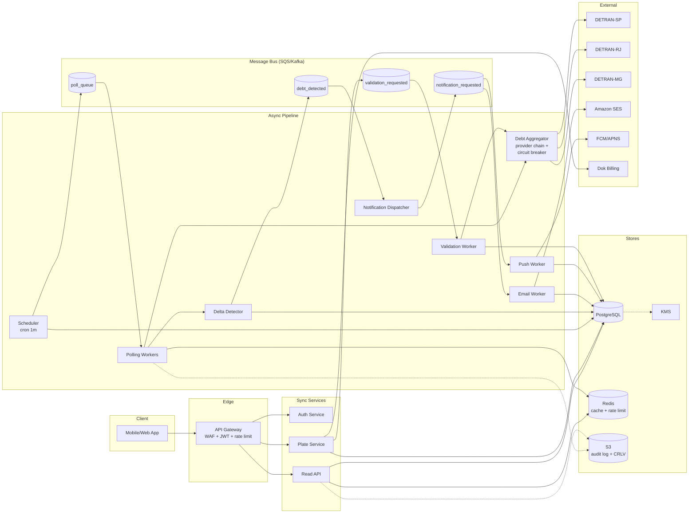

# Preparação — System Design ao vivo (Dok Despachantes)

> Doc de estudo construído na sessão de coach. Cobre o cenário **mais provável** da próxima fase: 1h ao vivo, problema "real ou inspirado em desafios reais da Dok", sem gabarito fechado.
>
> **Cenário escolhido:** Plataforma de **monitoramento proativo de débitos veiculares** — cliente cadastra placas, sistema avisa antes que ele descubra. É a evolução natural do HomeTest e força tudo que cabe em 1h: sharding, scheduling, rate-limit, notificações, LGPD, custo, observabilidade.
>
> Mesmo que caia outro cenário (pagamento+conciliação, transferência, hub multi-DETRAN — Departamento Estadual de Trânsito), 80% das decisões aqui se transferem.

---

## Sumário

1. [Como conduzir a sessão (meta)](#como-conduzir-a-sessão-meta)
2. [Fase 1 — Perguntas](#fase-1--perguntas)
3. [Fase 2 — Requisitos funcionais](#fase-2--requisitos-funcionais)
4. [Fase 3 — Não-funcionais](#fase-3--não-funcionais)
5. [Fase 4 — Estimativas](#fase-4--estimativas)
6. [Fase 5 — APIs / contratos](#fase-5--apis--contratos)
7. [Fase 6 — Desenho macro](#fase-6--desenho-macro)
8. [Fase 7 — Deep dive](#fase-7--deep-dive)
9. [Checklist mental antes da sessão](#checklist-mental-antes-da-sessão)
10. [Prompts para gerar o diagrama no Excalidraw](#prompts-para-gerar-o-diagrama-no-excalidraw)

---

## Como conduzir a sessão (meta)

**Tempo total: 1h.** Distribuição alvo:

```
Fase 1 — Perguntas              ████░░░░░░░░░░░░░░░░  5–10 min
Fase 2 — Requisitos funcionais  ███░░░░░░░░░░░░░░░░░  5 min
Fase 3 — Não-funcionais         ███░░░░░░░░░░░░░░░░░  5 min
Fase 4 — Estimativas            ███░░░░░░░░░░░░░░░░░  5 min
Fase 5 — APIs                   ████░░░░░░░░░░░░░░░░  5–8 min
Fase 6 — Desenho macro          ████████░░░░░░░░░░░░  15 min
Fase 7 — Deep dive              ████████████░░░░░░░░  10–15 min
                              (10 min de buffer e perguntas finais)
```

**Sinais positivos por fase** (o que o avaliador anota):

| Fase | Bom sinal | Mau sinal |
|---|---|---|
| 1 | Pergunta antes de desenhar; separa funcional de não-funcional; pede números. | Sai desenhando; assume realtime; ignora modelo de negócio. |
| 2 | Lista MoSCoW (Must / Should / Could / Won't); justifica Won't. | Tudo é Must; lista features sem prioridade. |
| 3 | Quantifica e justifica cada NFR (Non-Functional Requirement) ligando à decisão arquitetural. | "99.99%! Baixa latência!" sem justificativa. |
| 4 | Cálculo nas costas do envelope; ordens de grandeza; liga número a decisão. | Planilha precisa; calcula coisas irrelevantes (ex.: bytes de tudo). |
| 5 | API (Application Programming Interface) mínima e coerente; idempotência; versão; status codes pensados. | CRUD (Create, Read, Update, Delete) completo de tudo; sem idempotência onde precisa. |
| 6 | Componentes com responsabilidade clara; queue/cache só onde justifica; aponta SPOFs (Single Points Of Failure). | "Vou jogar Kafka aqui" sem motivo; tudo síncrono ou tudo assíncrono. |
| 7 | Aprofunda no que o avaliador escolher; reconhece o que não sabe. | Blefa; muda de assunto. |

**4 mandamentos de live design:**

1. **Pense alto.** Silêncio prolongado é avaliado como travamento.
2. **Pode mudar de ideia.** Reconhecer que uma decisão não se sustenta = ponto positivo.
3. **Reconheça o que não sabe.** "Não conheço a fundo X mas o conceito que eu aplicaria é Y" >>> blefe.
4. **Não decore arquiteturas famosas.** Raciocine sobre o problema na frente.

---

## Fase 1 — Perguntas

### O problema (típico)

> *"A Dok quer lançar um produto novo: monitoramento proativo de débitos veiculares. O cliente cadastra uma ou mais placas e a Dok o avisa, antes que ele descubra por conta própria, sempre que aparecer um IPVA (Imposto sobre a Propriedade de Veículos Automotores) novo, uma multa nova, ou abrir a janela de licenciamento. Projete o sistema."*

### Perguntas que um sênior faz (5–10 min ANTES de desenhar)

Agrupar por categoria sinaliza maturidade.

**Negócio / Produto**
- Quem é o cliente — pessoa física, jurídica, frotista? V1 e estado estável.
- Modelo de monetização: grátis, freemium, assinatura paga? Quanto?
- Qual o **custo permitido por placa por mês**? (define se polling cego é viável)
- Quem pode monitorar uma placa: só o dono? Qualquer um? Como provar vínculo?

**Escala**
- Quantos clientes ativos no ano 1? E no estado estável (3-5 anos)?
- Placas por cliente: média e p99?
- Distribuição geográfica (quais estados primeiro)?

**SLA (Service Level Agreement) / freshness**
- O que "antes que ele descubra" significa em **minutos/horas/dias**?
- IPVA, multa, licenciamento têm SLA igual ou diferente?
- O cliente espera notificação push imediata ou aceita digest diário?

**Fonte de dados**
- A fonte é o mesmo DETRAN do HomeTest? 27 estados em V1 ou expansão gradual?
- Há **rate limit** por DETRAN? Quanto?
- Cobra por consulta? Quanto?
- É API ou scraping? Tem SLA contratual ou é best-effort?

**Notificação**
- Quais canais — push, email, SMS, WhatsApp?
- Cliente escolhe canais e granularidade?
- Anti-spam: o que fazer se aparecem 10 multas de uma vez?

**Restrições**
- LGPD (Lei Geral de Proteção de Dados): vínculo CPF (Cadastro de Pessoas Físicas)↔placa é dado pessoal categórico — confirma compliance?
- Prazo do MVP (Minimum Viable Product) — quando precisa ir ao ar?
- Direito ao esquecimento — qual a janela de purge?

### Restrições típicas que o avaliador devolve

> Em entrevista real você não recebe tudo de uma vez — recebe sob demanda. Mas o conjunto abaixo é coerente e amarra bem o desenho.

- **Público:** B2C (Business to Consumer, V1) e B2B (Business to Business, V2). Vínculo obrigatório (CPF do cadastro = proprietário no DETRAN, OU upload de CRLV — Certificado de Registro e Licenciamento de Veículo).
- **Modelo:** assinatura ~R$9,90/placa/mês. Trial 30 dias. Custo permitido na ordem de centavos/placa/mês.
- **SLA:** **NÃO é tempo real.** IPVA: D+1/D+2. Multa nova: ≤24h. Licenciamento: aviso 30d antes.
- **Volume:** Ano 1 = 100k clientes × 1.5 placas. Ano 3 = 1M × 1.8 placas. 70% SP/RJ/MG no ano 1.
- **Fonte:** DETRANs estaduais. **V1 só SP.** Rate limit heterogêneo (1–10 RPS — Requests Per Second — por DETRAN). Custo: alguns cobram (R$0,05/consulta em SP), outros não. Web scraping em alguns estados.
- **Notificação V1:** push (app) + email. WhatsApp em V2. SMS (Short Message Service) nunca (caro).
- **LGPD:** crítica. Mascarar placa em logs, criptografar PII em repouso, audit log, purge ≤30d após cancelamento.
- **MVP:** 4 meses, só SP, IPVA + multa, push + email.
- **Snapshot inicial:** ao cadastrar placa, cliente recebe débitos atuais (reusa serviço HomeTest).

> 🎓 Armadilha eliminada: **"proativo" não é tempo real.** O DETRAN não tem fonte de evento — não há webhook, não há fila pública. Tempo real exigiria polling agressivo, violaria rate limit e estouraria o budget. Decisão arquitetural: **polling agendado + delta detection**.

---

## Fase 2 — Requisitos funcionais

> Formato MoSCoW: **Must / Should / Could / Won't** (this time).
> A diferença entre Must e Should: Must = sem isso, não lança. Should = lança sem se o prazo apertar. Won't = explicitamente descartado, com justificativa.

### V1 — Must
1. Cadastro de cliente B2C (email + senha + CPF).
2. Cadastro de placa com **validação de vínculo** (CPF↔proprietário no DETRAN, ou upload de CRLV).
3. **Snapshot inicial:** ao cadastrar a placa, cliente vê os débitos atuais (reusa o serviço do HomeTest).
4. Polling agendado dos débitos por placa, dentro do SLA (≤24h pra detectar delta).
5. **Detecção de delta** entre consulta atual e último snapshot — identifica "novo".
6. Notificação por **email** quando há débito novo (canal default V1).
7. Cliente pode **pausar/cancelar** monitoramento de uma placa.
8. **Audit log** de toda consulta a dado pessoal (LGPD).
9. Integração com plataforma de billing existente da Dok pra cobrança da assinatura.

### V1 — Should
- Push notification (app) como canal alternativo.
- Histórico de débitos detectados e notificações enviadas, visível ao cliente.
- Aviso de janela de **licenciamento** abrindo (30d antes).

### V1 — Could
- Digest diário anti-spam (>3 eventos/dia/placa).
- Cliente personaliza granularidade (tudo / só vencendo / só multas novas).

### V1 — Won't (explicitamente fora do escopo)
- **Tempo real / streaming** — sem fonte de evento, custo proibitivo.
- **Cobertura nacional** — só SP em V1.
- **WhatsApp, SMS** — V2 (BSP — Business Solution Provider — custoso) e nunca (caro).
- **B2B com cost center / batch / relatórios fiscais** — V2.
- **Pagamento dos débitos pelo app** — é outro produto da Dok.

> 🎓 Sinal sênior: **Won't bem justificado** demonstra que você descarta requisito com motivo, não por esquecimento.

---

## Fase 3 — Não-funcionais

| # | Categoria | Requisito | Por que esse número | Decisão que amarra |
|---|---|---|---|---|
| 1 | **Disponibilidade (app/API)** | **99.9%** mensal (~43min/mês) | Produto pago, app é a face. 99.99% custa muito (multi-AZ — Availability Zone — síncrono) sem ROI (Return On Investment) claro pra V1. | 1 região ativa + standby; multi-region só em V2. |
| 2 | **Disponibilidade (pipeline polling)** | **99.5%** | Pipeline é assíncrono; 1h de atraso não derruba produto. | Workers stateless, fila durável, sem replicação síncrona. |
| 3 | **Latência (app)** | Listagem: **p99 < 300ms**. Cadastro com validação: **p99 < 5s**. | Listagem é tela inicial. Cadastro chama provider externo, justifica chamada lenta. | Cache de leitura agressivo; chamada síncrona ao DETRAN só no cadastro. |
| 4 | **Consistência** | **Eventual** pra dados de débito (≤24h aceitável). **Forte** pra billing. | DETRAN é fonte autoritativa; cache é cópia. Dinheiro não tolera lag. | Cache desacoplado; pagamento com idempotency key. |
| 5 | **Durabilidade** | Audit log: **zero perda**, retenção **5 anos**. Snapshot durável. Notificação: histórico persistido. | LGPD + auditoria. Sem snapshot durável, não há delta detection. | Audit em append-only object store, não na DB (Database) transacional. |
| 6 | **Segurança / LGPD** | Auth: cliente só vê próprias placas. PII (Personally Identifiable Information) criptografada em repouso (KMS — Key Management Service) e em trânsito (TLS — Transport Layer Security — 1.2+). Plate masking em logs. Purge ≤30d após cancelamento. | LGPD não-negociável; vínculo CPF↔placa é dado pessoal categórico. | Tabelas com colunas criptografadas; chave por tenant (crypto-shredding em V2). |
| 7 | **Custo (operacional)** | Infra ≤ **R$0,10/placa/mês**. Polling ≤ **R$0,03/placa/mês**. | Assinatura R$9,90; precisa margem. Polling é a maior alavanca. | Cache agressivo; polling diferenciado por debt_type; smearing. |
| 8 | **Observabilidade** | SLO (Service Level Objective) com error budget. Alerta: erro DETRAN >5%/5min, p99 dobrar, circuit breaker abrir. Tracing E2E (End-to-End). | Cada DETRAN é dependência crítica e independente. | Métrica e dashboard por provider (parente do HomeTest). |

**Omitidos com justificativa:**
- **Throughput:** Fase 4 mostra que pico é ~50 RPS. Não é gargalo, não merece NFR dedicado.
- **Compliance:** está dentro de Segurança/LGPD. Listar separado é redundância.

---

## Fase 4 — Estimativas

> 🎓 Cálculo nas costas do envelope. Números redondos, ordem de grandeza, **cada estimativa amarra uma decisão.**

### Cálculo 1 — Volume de polling (RPS — Requests Per Second)

```
Estado estável: 1M clientes × 1.8 placas = 1.8M placas
Polling: 1 consulta/placa/dia (ingênuo)
Janela útil: DETRAN responde em horário comercial — ~12h/dia

→ RPS médio na janela = 1.8M / (12 × 3600) ≈ 42 RPS por DETRAN
→ V1 (SP, 225k placas) = ~5 RPS. Trivial do nosso lado.
```

**Decisão:** o gargalo **não somos nós — é a fonte** (DETRAN aceita 1-10 RPS). Precisa **rate limit + scheduling por estado**, não autoscale agressivo.

### Cálculo 2 — Custo de polling

```
1.8M consultas/dia × R$0,05 = R$90.000/dia
× 30 dias = R$2.7M/mês
÷ 1M clientes ≈ R$2,70/cliente/mês de custo de provider
```

**Conclusão:** custo de provider sozinho consome **27% da assinatura**. Inviável.

**Decisão:** **polling diferenciado** + cache. IPVA muda 1x/ano → consulta semanal. Multa → diária. Licenciamento → mensal fora da janela. Reduz custo em 5–10x.

### Cálculo 3 — Storage

```
Audit log:      10 consultas/placa/dia × 200B × 1.8M = 3.6 GB/dia
                × 365 × 5 anos                       = ~7 TB

Snapshots:      5KB × 1.8M placas                    = ~9 GB
Notificações:   100/placa/ano × 200B × 1.8M          = ~36 GB/ano
```

**Decisão:** dados quentes (snapshots, perfil, billing) cabem em **1 PostgreSQL bem indexado** (GB-baixo TB). Audit log NÃO mora na DB transacional → vai pra **append-only object store (S3 — Simple Storage Service)** com particionamento por mês. Custo derruba em ~100x.

### Cálculo 4 — Pico de notificação

```
Cenário: blitz na marginal num domingo → 50k multas no mesmo lote
Detecção concentrada em ~1h de polling
→ 50k notificações em 1h = ~14 push/email por segundo
```

**Decisão:** notificação **assíncrona via fila** com workers escaláveis. Não pode mandar inline na detecção. Idempotência por (placa, debt_id, canal) pra evitar duplicata em retry.

### O que NÃO calcular (e por quê)

- Bandwidth de app pro cliente — commodity, não é decisão.
- Memória/CPU (Central Processing Unit) dos serviços — depois do desenho macro, não antes.
- Quantidade exata de servidores — "scale horizontal, capacity planning depois do load test".

---

## Fase 5 — APIs / contratos

> 🎓 Sinais positivos: **API mínima + idempotência onde precisa + versionamento + status codes pensados.** Não desenhe CRUD completo de tudo.

### Princípios

- REST (Representational State Transfer) com versionamento em path (`/v1/...`).
- Auth via **JWT** — JSON Web Token; JSON = JavaScript Object Notation — (access token curto + refresh token); claims contêm `userId`.
- **Idempotência obrigatória** em POST de cadastro e em billing (header `Idempotency-Key`).
- Status codes literais (compatíveis com o estilo do HomeTest):
  - `400 invalid_payload`
  - `401 unauthorized`
  - `403 forbidden`
  - `404 not_found`
  - `409 conflict`
  - `422 unprocessable` (regra de domínio: tipo desconhecido, etc.)
  - `503 upstream_unavailable`

### Endpoints síncronos

```
POST /v1/auth/signup
  Body: { email, password, cpf, name }
  201:  { userId, accessToken, refreshToken }
  Erros: 400, 409 email_already_registered

POST /v1/auth/login
  Body: { email, password }
  200: { accessToken, refreshToken }
  Erros: 401

POST /v1/plates                                  [Idempotency-Key]
  Body: { plate, validationMethod: "cpf_match" | "crlv_upload", crlvFileId? }
  202: { plateId, status: "validating" }
  Erros: 400 invalid_plate, 409 already_monitored
  Nota: validação é assíncrona; cliente faz polling em GET ou recebe push.

GET  /v1/plates
  200: { items: [{ plateId, plate (masked), status, lastChecked, debtsCount }] }

GET  /v1/plates/{plateId}
  200: { plate (masked), validationStatus, monitoringStatus,
         currentDebts: [...], lastNotificationAt }
  Erros: 403 forbidden (não é dono), 404

DELETE /v1/plates/{plateId}
  202: { plateId, gracePeriodEndsAt }
  Nota: soft-delete; purga total após 30d (LGPD).

GET  /v1/plates/{plateId}/notifications?since=ISO&limit=50
  # ISO = ISO 8601 datetime (International Organization for Standardization)
  200: { items: [...], nextCursor }

PUT  /v1/plates/{plateId}/preferences
  Body: { channels: ["email", "push"], granularity: "all" | "due_only" | "new_fines_only" }
  200: { updated: true }
```

### Eventos assíncronos (message bus interno)

```
DebtDetected v1
  { plateId, userId, debtId, debtType: "IPVA"|"MULTA"|"LICENCIAMENTO",
    value, dueDate, source: "DETRAN-SP", detectedAt }

NotificationRequested v1
  { userId, plateId, debtId, channel: "email"|"push",
    payload: { title, body, deepLink }, idempotencyKey }

AuditEvent v1
  { actor, target, action, ip, userAgent, occurredAt }

ValidationRequested v1
  { plateId, userId, method, crlvFileId? }
```

> 🎓 Idempotência em eventos: cada consumer mantém um set/cache de `idempotencyKey` recentes (24h em Redis) pra absorver redelivery do bus.

---

## Fase 6 — Desenho macro

### Componentes (com responsabilidade clara)

**Edge**
- **CDN (Content Delivery Network) + WAF (Web Application Firewall)** (CloudFront / Cloudflare) — cache estático, proteção DDoS (Distributed Denial of Service).
- **API Gateway** — TLS termination, auth check (JWT), rate limit por user.

**Sync (cliente-facing)**
- **Auth Service** — signup/login, emissão de JWT.
- **Plate Service** — CRUD de placas; orquestra validação (emite `ValidationRequested`).
- **Read API** — listagem de placas + débitos atuais (alta cache hit).

**Async pipeline (o coração)**
- **Scheduler** — cron + tabela `scheduled_polls(plate_id, debt_type, next_check_at)`. A cada minuto, varre `WHERE next_check_at < now()` e publica em `poll_queue`.
- **Poll Queue** (SQS — Simple Queue Service — / RabbitMQ) — desacopla scheduler de workers; fornece retry e backoff.
- **Polling Workers** — consomem queue, fazem rate-limit check (Redis token bucket por DETRAN), chamam Debt Aggregator.
- **Debt Aggregator** — *o coração reusa o HomeTest:* chain de `IDebtProvider`, circuit breaker isolado por DETRAN, normalização canônica.
- **Delta Detector** — compara result com último snapshot em PG; emite `DebtDetected` para o que é novo; atualiza snapshot.
- **Notification Dispatcher** — consome `DebtDetected`, lê preferences, aplica anti-spam (digest), emite `NotificationRequested(channel)`.
- **Channel Workers** — Email (via SES — Simple Email Service) e Push (FCM — Firebase Cloud Messaging — / APNS — Apple Push Notification Service); idempotência por chave; grava resultado em `notifications_history`.
- **Validation Worker** — consome `ValidationRequested`, faz CPF↔proprietário OU OCR de CRLV; ativa placa.

**Stores**
- **PostgreSQL** (RDS — Relational Database Service — /Aurora) — `users`, `plates`, `debt_snapshots` (latest), `preferences`, `billing_refs`, `scheduled_polls`, `notifications_history`. Particionamento por `user_id` em `notifications_history`.
- **Redis** (ElastiCache) — cache de débitos por placa (TTL — Time To Live — 12h), rate limiter por DETRAN (token bucket), set de idempotência (24h TTL).
- **S3** — audit log (Parquet particionado por mês), CRLVs uploaded.
- **Message bus** (SQS / Kafka) — `poll_queue`, eventos (`DebtDetected`, `NotificationRequested`, `AuditEvent`, `ValidationRequested`).

**External**
- **DETRANs estaduais** — Provider A, B, ... (cada um com circuit breaker isolado).
- **SES** (email), **FCM/APNS** (push).
- **Billing platform** (Dok existente).

**Cross-cutting**
- **OpenTelemetry** + Prometheus + Grafana + Loki — métricas, traces, logs.
- **KMS** — chaves de criptografia de PII.
- **Audit interceptor** — middleware na API Gateway e nos workers; emite `AuditEvent` em toda leitura de dado pessoal.

### Fluxo principal narrado

**1) Cadastro e validação de placa (assíncrono)**
```
App → Gateway → Plate Service
  └─ grava em PG (plates.status = "validating")
  └─ publica ValidationRequested
  └─ retorna 202 com plateId

ValidationWorker (consumer):
  └─ se cpf_match: chama Debt Aggregator (consulta DETRAN, compara CPF)
     se crlv_upload: chama OCR (Optical Character Recognition) em arquivo no S3
  └─ atualiza PG (status = "active" | "rejected")
  └─ publica PlateActivated
  └─ Scheduler insere primeira entrada em scheduled_polls
  └─ Notification Dispatcher emite welcome notification
```

**2) Loop de monitoramento (o produto)**
```
Scheduler (cron 1min):
  SELECT plate_id, debt_type FROM scheduled_polls
   WHERE next_check_at < now()
   LIMIT N
  → publica em poll_queue (mensagem por placa+tipo)

Polling Worker:
  └─ pega 1 mensagem
  └─ rate-limit check (Redis token bucket por DETRAN); se sem token, devolve à fila com delay
  └─ chama Debt Aggregator (HomeTest reusado)
  └─ Delta Detector: compara com snapshot atual em PG
  └─ pra cada novidade: publica DebtDetected
  └─ atualiza snapshot
  └─ atualiza next_check_at conforme regra (debt_type + heurística "houve mudança recente?")
  └─ Audit interceptor emite AuditEvent → S3

Notification Dispatcher:
  └─ consome DebtDetected
  └─ lê preferences do user
  └─ se >3 eventos no dia para essa placa: digest (segura até cron de digest)
  └─ emite NotificationRequested(channel) para cada canal habilitado

Channel Worker (Email | Push):
  └─ consome NotificationRequested
  └─ idempotency check (Redis: hash(plateId, debtId, channel))
  └─ envia via SES/FCM
  └─ grava em notifications_history (PG)
```

**3) Leitura cliente (síncrono, rápido)**
```
App → Gateway → Read API
  └─ cache Redis (chave: user_id:plates) → hit em ~95% dos casos
  └─ miss: PG + atualiza Redis
  └─ retorna lista
```

### ASCII (American Standard Code for Information Interchange) overview

```
                             ┌──────────────┐
                             │  App / Web   │
                             └──────┬───────┘
                                    │ HTTPS
                             ┌──────▼───────┐
                             │ API Gateway  │  WAF + JWT + rate limit
                             └──┬───────┬───┘
                                │       │
                ┌───────────────┘       └───────────────┐
                │                                       │
        ┌───────▼─────────┐                    ┌────────▼────────┐
        │  Auth Service   │                    │  Plate Service  │──┐
        └─────────────────┘                    └────────┬────────┘  │
                                                        │           │
                                          ┌─────────────▼─┐         │
                                          │   Read API    │  ── Redis cache
                                          └───────────────┘         │
                                                                    │ emits
                                  ┌─────────────────────────────────▼──┐
                                  │    Message Bus (SQS / Kafka)       │
                                  │  poll_queue · events · validations │
                                  └─┬──────┬──────┬──────┬─────────────┘
                                    │      │      │      │
                       ┌────────────▼┐ ┌───▼───┐ │      ▼
                       │  Scheduler  │ │Polling│ │ ┌─────────────────┐
                       │   (cron)    │ │Workers│ │ │ Validation Wkr  │
                       └─────────────┘ └───┬───┘ │ └─────────────────┘
                                           │     │
                                  ┌────────▼─────┴─────────┐
                                  │   Debt Aggregator      │ ← reusa HomeTest
                                  │  (provider chain +     │
                                  │   circuit breaker      │
                                  │   por DETRAN)          │
                                  └────┬───────────┬───────┘
                                       │           │
                            ┌──────────▼──┐    ┌───▼──────────┐
                            │ DETRAN-SP   │    │  DETRAN-RJ   │ ...
                            └─────────────┘    └──────────────┘

                       ┌──────────────────────────────────┐
                       │ Delta Detector → DebtDetected →  │
                       │ Notification Dispatcher → Email/ │
                       │ Push Workers                     │
                       └──────────────────────────────────┘

  Stores: PostgreSQL (transacional) · Redis (cache + rate limit) ·
          S3 (audit log + CRLVs) · KMS (chaves)
  Cross-cutting: OpenTelemetry + Prometheus + Grafana + Loki
```

### Decisões-chave a defender

| Decisão | Por quê |
|---|---|
| Polling agendado (não streaming) | DETRAN não tem fonte de evento; SLA do produto tolera ≤24h. |
| Queue entre Scheduler e Workers | Backpressure, retry, isolar pico, escalar workers independente. |
| Circuit breaker por DETRAN (não global) | Falha de SP não pode derrubar consultas de RJ. (Mesma decisão do HomeTest.) |
| Eventual consistency em débito | DETRAN é fonte; cache é cópia; cliente aceita 24h. |
| Strong consistency em billing | Dinheiro. Idempotency-Key obrigatório. |
| Audit log em S3 (não em PG) | 7TB em 5 anos; PG ficaria caro e lento. S3 + Athena resolve. |
| 1 PG transacional | ~10GB de dados quentes. Não precisa sharding. |
| Push + Email V1, não SMS/WhatsApp | SMS caro; WhatsApp BSP custoso pra V1. |
| 1 região ativa (V1) | 99.9% basta; multi-region em V2. |

### SPOFs identificados (e mitigação)

- **PostgreSQL** — réplica síncrona standby, RPO (Recovery Point Objective) ~0.
- **Redis** — cluster mode + AOF (Append-Only File); perda do cache só impacta latência (cold cache).
- **DETRAN externo** — circuit breaker por estado; UI (User Interface) mostra "última atualização há X" honestamente.
- **API Gateway** — multi-AZ atrás de LB (Load Balancer).
- **Scheduler** — leader election (1 ativo, demais em standby); job idempotente.

---

## Fase 7 — Deep dive

> Avaliador escolhe 1-2 pontos pra aprofundar. Os mais prováveis pra esse problema:

### Deep dive A — Polling Scheduler (gargalo de custo)

**Problema:** 1.8M placas × 1 consulta/dia × R$0,05 = R$2.7M/mês = 27% da assinatura. Inviável.

**Solução em camadas:**

**1. Polling diferenciado por debt_type**
- IPVA — emitido 1x/ano, vence anualmente. Consulta **semanal** fora da janela de vencimento; **diária** nos 3 meses anteriores.
- Multa — pode aparecer a qualquer momento. Consulta **diária**.
- Licenciamento — janela mensal por estado. **Semanal** fora; **diária** dentro.

**2. Cache Redis (TTL = SLA / 2)**
- SLA 24h → cache 12h. Listagem do app sempre serve do cache; polling atualiza cache.
- Reduz consultas redundantes em listagem para 0.

**3. Smearing (suavização de carga)**
- `next_check_at` aleatorizado dentro da janela permitida (ex.: distribui em 12h, não dispara tudo às 00:00).
- Hash da placa decide o "horário base" → distribuição estável e idempotente.

**4. Backoff em "no change"**
- Heurística: se últimas N consultas detectaram zero delta, multiplica intervalo por 1.5 (cap em 7d para multa, 30d para IPVA fora janela).
- Reset ao detectar mudança.

**5. Rate limit por DETRAN (token bucket Redis)**
- Chave: `rate:detran:SP`. Bucket: 10 tokens, refill 10/s.
- Worker: `EVAL` Lua atômico → consome 1 token; se falhar, devolve mensagem com `visibility_timeout` ajustado.
- Garante que **pulo de tráfego do nosso lado nunca derruba o DETRAN nem causa ban.**

**6. Backfill controlado em outage**
- Se DETRAN-SP cai por 4h e volta: 4h × 10 RPS = 144k requests acumulados em fila.
- Workers drenam respeitando token bucket — leva ~4h pra recuperar.
- Durante isso, app mostra "última atualização há Xh" honesto.

**Resultado estimado:** redução de 5–10x no custo de polling (de R$2.7M/mês para R$300–500k/mês).

**Trade-off:** complexidade do scheduler aumenta. Vale porque o ganho é >R$2M/mês.

---

### Deep dive B — LGPD: direito ao esquecimento + audit log

**Problema:** cliente cancela; deve apagar PII em ≤30 dias. Audit log deve durar 5 anos. Conflito.

**Solução:**

**1. Soft delete + purge job**
- DELETE marca `deleted_at` + `purge_at = now() + 30d`.
- Job diário: `DELETE FROM users WHERE purge_at < now()` (cascateia em plates, snapshots, preferences).
- Notificações futuras bloqueadas em `purge_at - 30d` (cancelado).

**2. Audit log pseudonimizado em S3**
- Não armazena `user_id` direto — armazena `user_hash = HMAC(user_id, secret)` (HMAC = Hash-based Message Authentication Code).
- Mantém valor analítico (auditoria, fraude) sem identificar pessoa.
- Particionamento por mês (`s3://audit/year=2026/month=05/...`); query via Athena.

**3. Crypto-shredding (V2, opcional)**
- Cada user tem chave KMS individual; PII é criptografada com essa chave.
- No purge: deleta a chave KMS → dado vira ilegível mesmo em backup.
- Caro de operar (uma chave KMS por user × 1M users = R$20-50k/mês). Avaliar se compliance exige.

**4. Backups com retenção alinhada**
- Backups com PII: retenção máxima 30d.
- Backups mais antigos: só dados pseudonimizados ou agregados.

**5. Direito de acesso (LGPD art. 18)**
- Endpoint `GET /v1/me/export` — gera arquivo com TODOS os dados pessoais do user.
- Job assíncrono (pode demorar minutos); resultado num link assinado S3.

**Trade-offs explícitos:**

| Abordagem | Prós | Contras |
|---|---|---|
| Soft delete + job | Simples, barato, suficiente pra maioria | Backups ainda têm PII por janela curta |
| Crypto-shredding | Garantia forte mesmo em backup | Custo KMS, complexidade operacional |
| Pseudonimização do audit | Mantém auditoria + LGPD | Limita rastreabilidade pra investigação interna |

> 🎓 Em entrevista, explicitar **trade-off** assim é o ouro do deep dive. Avaliador adora.

---

### Outros deep dives possíveis (preparar resposta de 2-3 min cada)

- **Como você garante que uma notificação só vai 1x?** → Idempotency key `(plateId, debtId, channel)` em Redis; Channel Worker checa antes de enviar.
- **Como você lida com um DETRAN em scraping vs API?** → Adapter interface uniforme; scraping atrás de feature flag e com rate limit ainda mais agressivo; circuit breaker mais sensível.
- **Como você faz onboarding de um novo estado?** → Implementar `IDebtProvider` (mesma do HomeTest), registrar DI (Dependency Injection) com Polly, ajustar `ProvidersOptions`. Pipeline existente absorve.
- **E se o produto crescer 10x?** → Sharding de PG por `user_id`; dividir poll_queue em filas por estado; multi-region read replicas.
- **Como você detecta fraude (cliente monitorando placa que não é dele)?** → Validação de vínculo no cadastro (já temos); audit log alimenta análise periódica; rate limit de cadastros por user.
- **Custo total estimado da operação?** → Decompor: provider (~R$300-500k), infra (~R$50-100k), notificações (SES/FCM ~baratíssimo), pessoal/operação. Total / receita = margem de contribuição.

---

## Checklist mental antes da sessão

**Logística (na véspera):**
- [ ] Excalidraw aberto, logado, conta testada.
- [ ] Microfone, câmera, compartilhamento de tela testados.
- [ ] Dois monitores se possível (chamada num, desenho noutro).
- [ ] Água por perto.
- [ ] Ambiente silencioso confirmado.

**Mental (na hora):**
- [ ] **Não desenhar nos primeiros 5 min.** Perguntar.
- [ ] Pensar alto. Silêncio = ruído pro avaliador.
- [ ] Toda decisão tem custo — verbalizar trade-off.
- [ ] Não decorar — raciocinar. Se travar, usar o framework: "qual o requisito? que opções? trade-off?"
- [ ] Reconhecer "não sei" — explicar conceito que aplicaria.
- [ ] Reler o problema enquanto desenha — coisas mudam.

**Frases prontas que cabem no momento certo:**
- "Antes de desenhar, deixa eu fazer algumas perguntas pra entender melhor..."
- "Estou avaliando entre X e Y. O trade-off principal é Z. Vou começar por X porque [razão], mas posso voltar se algum requisito mudar."
- "Não conheço a fundo essa tecnologia, mas o conceito que eu aplicaria aqui é..."
- "Esse número é ordem de grandeza, costas-de-envelope. Se virar gargalo a gente refina depois com load test."
- "Boa pergunta — vou marcar pra voltar depois do desenho macro." *(quando o avaliador joga uma pergunta de detalhe cedo demais)*
- "Acabei de perceber que essa decisão não se sustenta porque [razão]. Vou ajustar pra X."

---

## Prompts para gerar o diagrama no Excalidraw

O Excalidraw tem 2 features de IA (Inteligência Artificial; em inglês, AI = Artificial Intelligence) úteis: **Text to Diagram** (linguagem natural) e **Mermaid to Excalidraw** (cola Mermaid e converte). Forneço os dois.

### Opção 1 — Text to Diagram (Excalidraw AI)

Cola isso na função "Generate diagram from text" do Excalidraw:

```
Architecture diagram for a vehicle debt monitoring platform. Show the
following components grouped left to right.

CLIENTS (left): Mobile App, Web App.

EDGE: API Gateway with WAF, JWT auth, rate limiting.

SYNC SERVICES: Auth Service, Plate Service, Read API. All behind the
API Gateway. Read API uses Redis cache.

MESSAGE BUS in the middle (SQS or Kafka), with topics: poll_queue,
debt_detected, notification_requested, validation_requested, audit.

ASYNC PIPELINE: Scheduler (cron) publishes to poll_queue. Polling
Workers consume poll_queue and call Debt Aggregator. Debt Aggregator
calls multiple DETRAN providers (DETRAN-SP, DETRAN-RJ, DETRAN-MG)
each isolated by its own circuit breaker. Polling Workers also write
to Delta Detector, which emits debt_detected events. Notification
Dispatcher consumes debt_detected and emits notification_requested.
Email Worker and Push Worker consume notification_requested and call
SES and FCM respectively. Validation Worker consumes
validation_requested.

DATA STORES (bottom): PostgreSQL (users, plates, snapshots, preferences,
notifications history); Redis (cache, rate limit token bucket,
idempotency); S3 (audit log, CRLV uploads); KMS (encryption keys).

EXTERNAL (right): DETRAN-SP, DETRAN-RJ, DETRAN-MG, SES (email),
FCM/APNS (push), Dok Billing Platform.

OBSERVABILITY (bottom strip): OpenTelemetry, Prometheus, Grafana, Loki.

Show arrows for: client request flow (sync, blue); polling pipeline
(async, green); notification pipeline (async, orange); external calls
(red). Group with labeled boxes.
```

### Opção 2 — Mermaid (cola direto em Excalidraw → Insert → Mermaid)



### Como usar no Excalidraw

1. Abra https://excalidraw.com
2. Clique no ícone do **menu** (canto superior esquerdo) → **AI** → **Mermaid to Excalidraw** *(ou)* **Text to diagram**.
3. Cola o prompt da Opção 1 (texto livre) ou o bloco Mermaid da Opção 2.
4. Excalidraw gera; você ajusta posições, cores e adiciona setas.

> 🎓 **Dica de live design:** **NÃO use IA durante a entrevista.** Avaliadores percebem e penalizam. Use a IA agora pra construir um modelo mental e treinar. Na entrevista, desenhe à mão (no Excalidraw mesmo, mas sem IA) — eles avaliam o seu raciocínio, não o output da ferramenta.

---

## Apêndice — Como esse desenho mapeia no HomeTest

Pra você defender com confiança, segue o mapping direto entre o que você já construiu e o que reusa no produto novo:

| HomeTest (existe) | System Design (reusa como) |
|---|---|
| `IDebtProvider` chain (Provider A/B) | **Debt Aggregator** no async pipeline |
| Circuit breaker isolado por provider | Mesmo, agora com 27 estados em vez de 2 |
| `Plate` value object com mascaramento | Reusado no logging end-to-end |
| `Money` HALF_UP, JSON string | Reusado em snapshots e notificações |
| `IDebtsClock` (tempo controlável) | Reusado pra testes integrados do scheduler |
| Status codes literais (400/422/503) | Reusado no API contract |
| ADRs (Architecture Decision Records) como prática | Cada decisão deste doc é candidata a ADR |

> 🎓 **Frase pronta:** *"Esse aggregator que estou desenhando aqui é a evolução natural da arquitetura que apresentei no HomeTest. As mesmas garantias de isolamento de provider e circuit breaker se aplicam — só multiplico de 2 para 27."* Mostra continuidade e tira pressão.

---

**Boa sorte. Você passou no mais difícil. Esse aqui é desenho — você já desenha bem.**
